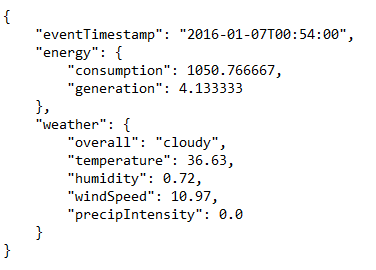
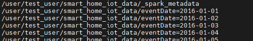
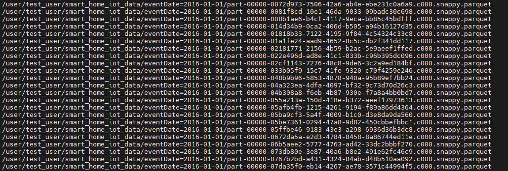
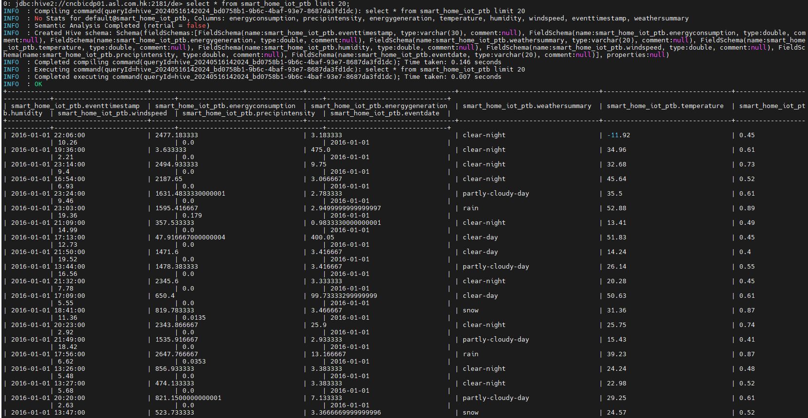
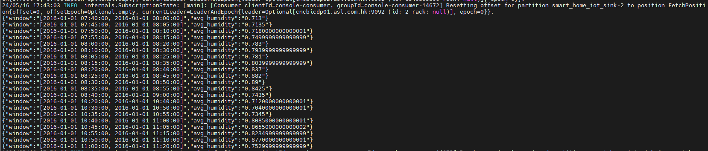
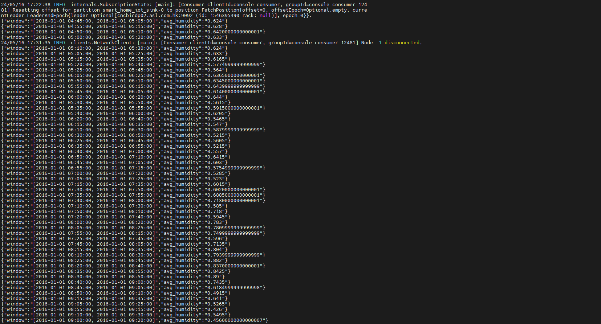

# Objectives 

This project imitates the process of streaming smart home data from an IoT source. Through Pyspark, the JSON-like data from a Kafka topic are streamed into a hive table and the aggregated data are then sent to another kafka topic for alert purpose.


## Dataset
The data are downloaded from a Kaggle dataset which contains the readings from a smart energy meter and the weather conditions of a particular region in seconds.

Links: https://www.kaggle.com/datasets/taranvee/smart-home-dataset-with-weather-information


## Environment
This project adopts Cloudera Data Platform (CDP) as the backbone and Kerberos as authentication means.

The components involved and the corresponding version are stated as below:
| Components                      | Version       | 
| --------------------------------|:-------------:|
| Hadoop (Includes YARN and HDFS) | 3.1.1         |
| Hive                            | 3.1.3         |
| Kafka                           | 3.4.1         |
| Spark                           | 2.4.8         |


## Data preparation
The data_preparation.py extracts one record per minute from the dataset and only keeps the parameters that we are interested in.

The extracted data are output as JSON format which minic the structure of IoT data



## Streaming data source 
Create a Kafka topic as streaming data source through below commands 
```bash
$ export KAFKA_OPTS="-Djava.security.auth.login.config=./kafka/jaas.config"
$ kafka-topics --create --partitions 3 factor 1 --topic smart_home_iot_source --bootstrap-server server1:9092 --command-config ./kafka/client.properties 
```
After that, run the producer.py which reads the records from the json file and publishs them to the Kafka topic "smart_home_iot_source".


## Load data to Hive table
Firstly, create a directory in HDFS for Hive external table
```bash
$ hdfs dfs -mkdir -p /user/test_user/smart_home_iot_data
```

Secondly, create a Hive external table with column "eventDate" as the partition key through hive beeline
```bash
CREATE EXTERNAL TABLE smart_home_iot_ptb(
eventTimestamp VARCHAR(30), energyConsumption DOUBLE, energyGeneration DOUBLE, weatherSummary VARCHAR(20), temperature DOUBLE, humidity DOUBLE, windSpeed DOUBLE, precipIntensity DOUBLE)
PARTITIONED BY (eventDate VARCHAR(20))
STORED AS PARQUET
LOCATION '/user/test_user/smart_home_iot_data';
```

Thridly, create a directory in HDFS for pyspark streaming checkpoint
```bash
$ hdfs dfs -mkdir -p /user/test_user/pyspark_checkpoint/load_to_hive
```

Forthly, run the pyspark_kafka_to_hdfs.py to stream the data to HDFS under the directory */user/test_user/smart_home_iot_data*

Looking into HDFS, partition folders of each date are created under the directory */user/test_user/smart_home_iot_data* and the parquet data file are stored in corresponding date folder.



Fifthly, run the command below through Hive beeline to let the Hive table recongize the newly created partition folders. After that, data can be queried from the Hive table.



## Load data to Kafka topic
Firstly, create a Kafka topic as streaming data sink through below commands
```bash
$ kafka-topics --create --partitions 3 factor 1 --topic smart_home_iot_sink --bootstrap-server server1:9092 --command-config ./kafka/client.properties 
```

Secondly, create a directory in HDFS for pyspark streaming checkpoint
```bash
$ hdfs dfs -mkdir -p /user/test_user/pyspark_checkpoint/load_to_kafka
```

Next, run pyspark_kafka_to_kafka.py which takes the average of humidity over a 20mins sliding windows. Windows with average humidity greater than 70% (0.7) will then be published to Kafka topic smart_home_iot_sink.


The screen capture below shows the data sent to Kafka topic if filter (avg humidity >70%) is not applied.


People can then be alerted about the high humidity if they consume the Kafka topic.


## Reference
1. https://subhamkharwal.medium.com/pyspark-structured-streaming-read-from-kafka-64c40767155f
2. https://medium.com/@aman.parmar17/handling-real-time-kafka-data-streams-using-pyspark-8b6616a3a084
3. https://stackoverflow.com/questions/43346332/create-hive-external-table-from-partitioned-parquet-files-in-azure-hdinsights